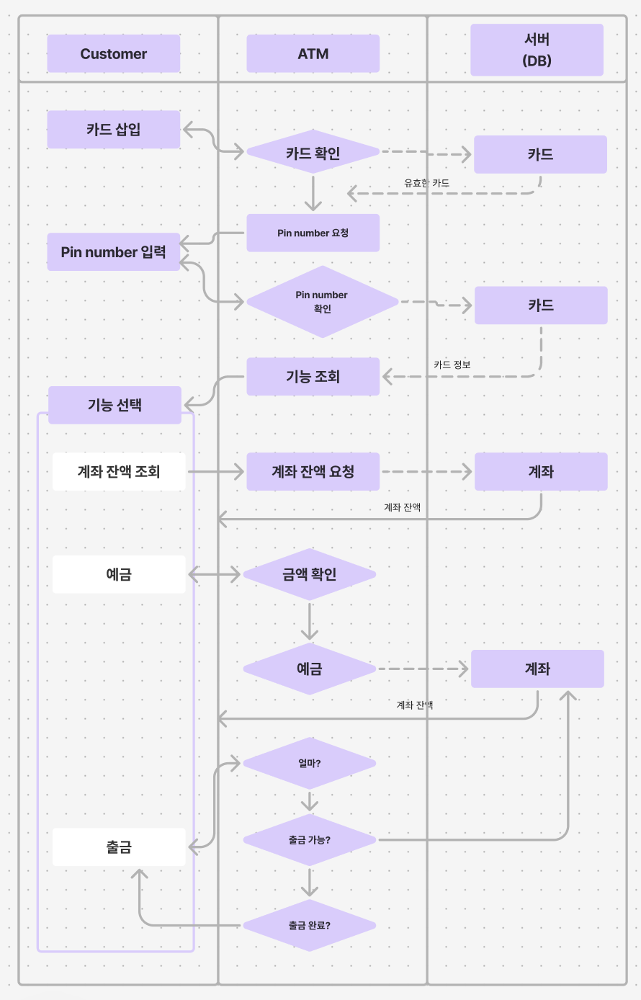
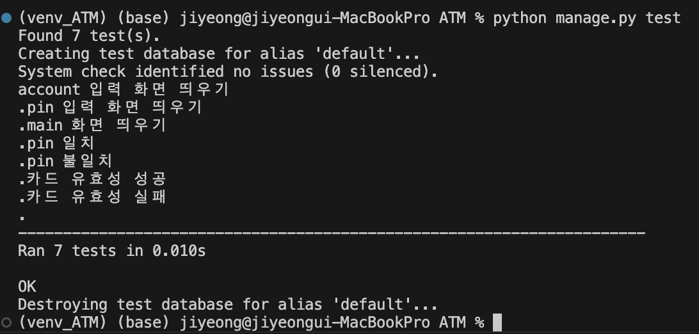

1. 프로세스
주요 프로세스 : 카드 삽입 -> pin 입력 -> 계좌 선택 -> 기능(잔액확인,예금,출금)
대략적인 프로세스는 다음과 같이 정리하였다.

간단한 ATM이기에 저장할 정보와 기능이 많지 않아 하나만 생성하기로 하였다.

2. 카드 삽입
실제 카드 손상 등 카드에서 오류가 나는 경우가 있으나, 기계적인 데이터를 입력받지 못하기 떄문에
DB에 있는 카드인 경우만 다음으로 넘어가게하였다. 
이때 카드 번호는 session에 저장하여 다음단계에서도 사용할 수 있게 하였다.

3. pin입력
pin을 입력하여 맞으면 다음 단계로 넘어가게하였다.
session에서 가져온 카드번호로 db에 pin과 비교하여 맞으면 넘어간다.
틀릴 경우 다시 입력을 받는다. 

4. account 선택
Saving account와 Deposit account를 선택하여 넘어가게 하였다.

5. 기능 선택
1)잔액 조회
2)예금
3)출금
-> 3가지 기능을 구현하고자 한다.

6. 테스트 코드
1)각 화면 호출
2)카드 검사 (카드가 유효한지 판단)
3)PIN 검사 (비밀번호가 맞는지 판단)

7. 시연 영상
.gif>)

